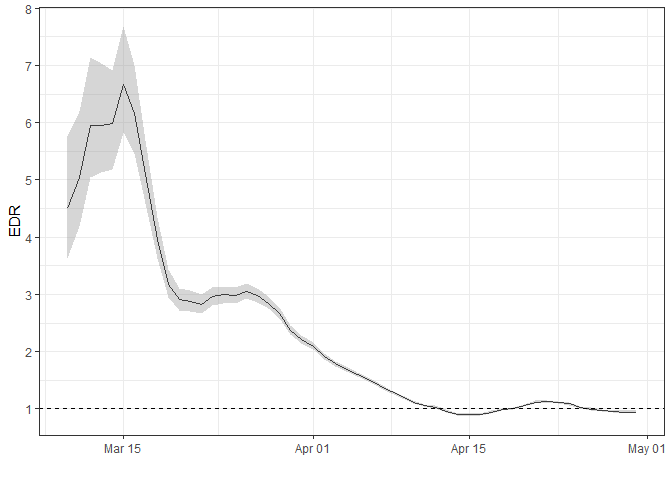
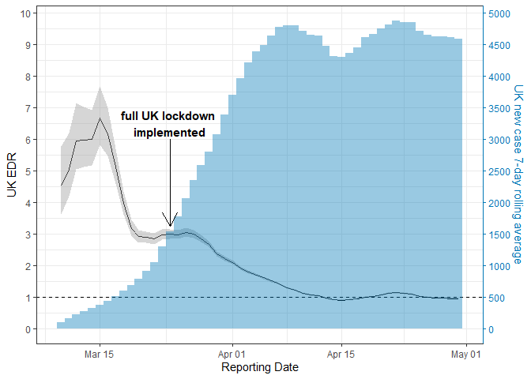

# edr

<!-- badges: start -->

[](https://github.com/NicChr/edr/actions/workflows/R-CMD-check.yaml)
<!-- badges: end -->

## Estimated Dissemination Ratio

This package is a fast implementation of the Estimated Dissemination
Ratio, described here

[Estimated Dissemination Ratio—A Practical Alternative to the
Reproduction Number for Infectious
Diseases](https://dx.doi.org/10.3389/fpubh.2021.675065)

## Installation

``` r
# install.packages("devtools")
devtools::install_github("NicChr/edr")
```

### Libraries

``` r
library(edr)
library(data.table)
library(ggplot2)
```

### Recreating Figure 1

To recreate figure 1 from the paper, we use data from the John Hopkins
COVID-19 data repository.  
Source:
[CSSEGISandData/COVID-19](https://github.com/CSSEGISandData/COVID-19)

### Data

``` r
data(uk_covid_cases)
setDT(uk_covid_cases)
```

### Some technical notes

`edr()` returns a `data.table` with class ‘edr’

``` r
temp <- edr(uk_covid_cases$new, 7)
temp
#> Key: <time>
#>       time cases       edr
#>      <int> <int>     <num>
#>   1:     1     0        NA
#>   2:     2     0        NA
#>   3:     3     0        NA
#>   4:     4     0        NA
#>   5:     5     0        NA
#>  ---                      
#> 432:   432  3947 0.9566844
#> 433:   433  4784 0.9337753
#> 434:   434  4069 0.8977741
#> 435:   435  4115 0.8625097
#> 436:   436  4565 0.8194020
```

``` r
class(temp)
#> [1] "edr"        "data.table" "data.frame"
```

If you want just the edr estimates as a regular vector you can use
`edr_only()`

``` r
temp[, edr2 := edr_only(cases, 7)][]
#> Key: <time>
#>       time cases       edr      edr2
#>      <int> <int>     <num>     <num>
#>   1:     1     0        NA        NA
#>   2:     2     0        NA        NA
#>   3:     3     0        NA        NA
#>   4:     4     0        NA        NA
#>   5:     5     0        NA        NA
#>  ---                                
#> 432:   432  3947 0.9566844 0.9566844
#> 433:   433  4784 0.9337753 0.9337753
#> 434:   434  4069 0.8977741 0.8977741
#> 435:   435  4115 0.8625097 0.8625097
#> 436:   436  4565 0.8194020 0.8194020
```

``` r

rm(temp) # Remove temp
```

### EDR calculation

Here we calculate the 7-day EDR with `edr()` along with 99% percentile
confidence intervals

``` r
edr_seven_day <- uk_covid_cases[, edr(new, window = 7, order_by = reporting_date,
                                     simulations = 1e04, alpha = 0.01)]
```

We also calculate the 7-day rolling average of new confirmed cases

``` r
edr_seven_day[, ma7 := frollmean(cases, n = 7, align = "right")][]
#> Key: <time>
#>            time cases       edr     lower     upper      ma7
#>          <Date> <int>     <num>     <num>     <num>    <num>
#>   1: 2020-01-22     0        NA        NA        NA       NA
#>   2: 2020-01-23     0        NA        NA        NA       NA
#>   3: 2020-01-24     0        NA        NA        NA       NA
#>   4: 2020-01-25     0        NA        NA        NA       NA
#>   5: 2020-01-26     0        NA        NA        NA       NA
#>  ---                                                        
#> 432: 2021-03-28  3947 0.9566844 0.9384146 0.9744761 5259.714
#> 433: 2021-03-29  4784 0.9337753 0.9162038 0.9516115 5170.714
#> 434: 2021-03-30  4069 0.8977741 0.8814257 0.9143629 4978.286
#> 435: 2021-03-31  4115 0.8625097 0.8465404 0.8796212 4762.286
#> 436: 2021-04-01  4565 0.8194020 0.8031209 0.8358233 4517.714
```

Finally plotting everything

``` r
edr_seven_day <- edr_seven_day[
  time >= as.Date("2020-03-10") & 
    time < as.Date("2020-05-01")]

scale_factor <- 500
uk_lockdown <- as.Date("2020-03-24")
```

There is a convenient plot method for edr objects defined in
`plot.edr()`.

``` r
edr_plot <- plot(edr_seven_day, include_cases = FALSE)
edr_plot
```



We just need to add a few things to recreate the figure

``` r
edr_plot +
  geom_col(aes(y = ma7 / scale_factor), width = 1, alpha = 0.4, fill = "#0077B6") +
  geom_segment(aes(x = uk_lockdown, y = 6, xend = uk_lockdown, yend = 3.25),
               arrow = arrow(length = unit(0.5, "cm"))) +
  annotate("text", x = uk_lockdown, y = 6, 
           label = "full UK lockdown \nimplemented",
           vjust = -0.1,
           fontface = "bold") +
  labs(x = "Reporting Date", y = "UK EDR") +
  scale_y_continuous(breaks = seq(0, 10, 1),
                     sec.axis = sec_axis(\(x) x * scale_factor,
                                         breaks = seq(0, 5000, 500),
                                         name = "UK new case 7-day rolling average")) +
  theme_bw() + 
  theme(axis.line.y.right = element_line(color = "#0077B6"), 
        axis.ticks.y.right = element_line(color = "#0077B6"),
        axis.text.y.right = element_text(color = "#0077B6"), 
        axis.title.y.right = element_text(color = "#0077B6")
  )
#> Scale for y is already present.
#> Adding another scale for y, which will replace the existing scale.
#> Warning in geom_segment(aes(x = uk_lockdown, y = 6, xend = uk_lockdown, : All aesthetics have length 1, but the data has 52 rows.
#> ℹ Please consider using `annotate()` or provide this layer with data containing
#>   a single row.
```


