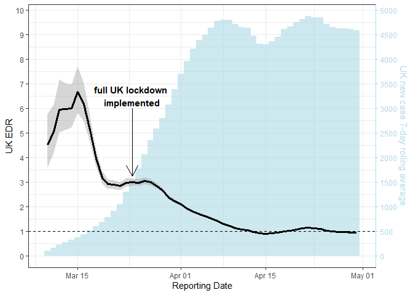

# edr

<!-- badges: start -->

[](https://github.com/NicChr/edr/actions/workflows/R-CMD-check.yaml)
<!-- badges: end -->

## Estimated Dissemination Ratio

This package is a fast implementation of the Estimated Dissemination
Ratio, described here

[Estimated Dissemination Ratio—A Practical Alternative to the
Reproduction Number for Infectious
Diseases](https://dx.doi.org/10.3389/fpubh.2021.675065)

## Installation

``` r
# install.packages("devtools")
devtools::install_github("NicChr/edr")
```

### Libraries

``` r
library(edr)
library(data.table)
library(ggplot2)
```

### Recreating Figure 1

To recreate figure 1 from the paper, we use data from the John Hopkins
COVID-19 data repository.  
Source:
[CSSEGISandData/COVID-19](https://github.com/CSSEGISandData/COVID-19)

### Data

``` r
uk_covid_cases <- structure(
  list(
    date = structure(
      c(18283, 18284, 18285, 18286, 
        18287, 18288, 18289, 18290, 18291, 18292, 18293, 18294, 18295, 
        18296, 18297, 18298, 18299, 18300, 18301, 18302, 18303, 18304, 
        18305, 18306, 18307, 18308, 18309, 18310, 18311, 18312, 18313, 
        18314, 18315, 18316, 18317, 18318, 18319, 18320, 18321, 18322, 
        18323, 18324, 18325, 18326, 18327, 18328, 18329, 18330, 18331, 
        18332, 18333, 18334, 18335, 18336, 18337, 18338, 18339, 18340, 
        18341, 18342, 18343, 18344, 18345, 18346, 18347, 18348, 18349, 
        18350, 18351, 18352, 18353, 18354, 18355, 18356, 18357, 18358, 
        18359, 18360, 18361, 18362, 18363, 18364, 18365, 18366, 18367, 
        18368, 18369, 18370, 18371, 18372, 18373, 18374, 18375, 18376, 
        18377, 18378, 18379, 18380, 18381, 18382), 
      class = "Date"
    ), 
    new = c(0L, 
            0L, 0L, 0L, 0L, 0L, 0L, 0L, 0L, 2L, 0L, 0L, 6L, 0L, 1L, 0L, 0L, 
            4L, 1L, 0L, 1L, 1L, 1L, 1L, 0L, 0L, 1L, 0L, 1L, 2L, 1L, 0L, 5L, 
            2L, 4L, 3L, 7L, 12L, 5L, 33L, 40L, 55L, 57L, 49L, 79L, 55L, 54L, 
            147L, 258L, 411L, 489L, 480L, 364L, 442L, 612L, 770L, 1006L, 
            1061L, 1255L, 1197L, 1423L, 2349L, 2392L, 2708L, 3111L, 3245L, 
            2852L, 2894L, 4302L, 4537L, 4967L, 4939L, 4951L, 4094L, 3620L, 
            5356L, 5484L, 5170L, 4912L, 4339L, 3628L, 3536L, 4209L, 4359L, 
            5102L, 5338L, 4985L, 4731L, 3867L, 4877L, 4771L, 5506L, 5153L, 
            4980L, 3783L, 3475L, 4707L, 4724L, 5445L, 4969L)
  ), 
  row.names = c(NA, -100L), 
  class = c("data.table", "data.frame"), 
  .internal.selfref = "<pointer: 0x00000142056ac6a0>"
)
```

### EDR calculation

Here we calculate the 7-day EDR with `edr()` along with 99% percentile
confidence intervals

``` r
edr_seven_day <- edr(uk_covid_cases$new, window = 7, simulations = 1e04, alpha = 0.01)

# Join estimates and confint to data
uk_covid_cases <- cbind(uk_covid_cases, edr_seven_day)
```

We also calculate the 7-day rolling average of new confirmed cases

``` r
uk_covid_cases[, ma7 := frollmean(new, n = 7, align = "right")]
```

Finally plotting everything

``` r
uk_covid_cases <- uk_covid_cases[date > as.Date("2020-03-10")]

scale_factor <- 500
# You could also calculate it more generally as below 
# scale_factor <- max(uk_covid_cases$ma7) / max(uk_covid_cases$est)
uk_lockdown <- as.Date("2020-03-23")

edr_plot <- uk_covid_cases |> 
  ggplot(aes(x = date, y = est)) + 
  geom_col(aes(y = ma7 / scale_factor), width = 1, alpha = 0.6, fill = "lightblue") +
  geom_smooth(aes(y = est, ymin = lower, ymax = upper), 
              stat = "identity", 
              linewidth = 1.25, 
              col = "black") +
  geom_hline(yintercept = 1, linetype = "dashed") +
  geom_segment(aes(x = uk_lockdown, y = 6, xend = uk_lockdown, yend = 3.25),
               arrow = arrow(length = unit(0.5, "cm"))) +
  annotate("text", x = uk_lockdown, y = 6, 
           label = "full UK lockdown \nimplemented",
           vjust = -0.1,
           fontface = "bold") +
  scale_y_continuous(breaks = seq(0, 10, 1),
                     name = "UK EDR", 
                     sec.axis = sec_axis(\(x) x * scale_factor,
                                         breaks = seq(0, 5000, 500),
                                         name = "UK new case 7-day rolling average")) +
  theme_bw() + 
  theme(axis.line.y.right = element_line(color = "lightblue"), 
        axis.ticks.y.right = element_line(color = "lightblue"),
        axis.text.y.right = element_text(color = "lightblue"), 
        axis.title.y.right = element_text(color = "lightblue")
  )

edr_plot
#> Warning in geom_segment(aes(x = uk_lockdown, y = 6, xend = uk_lockdown, : All aesthetics have length 1, but the data has 51 rows.
#> ℹ Please consider using `annotate()` or provide this layer with data containing
#>   a single row.
```


